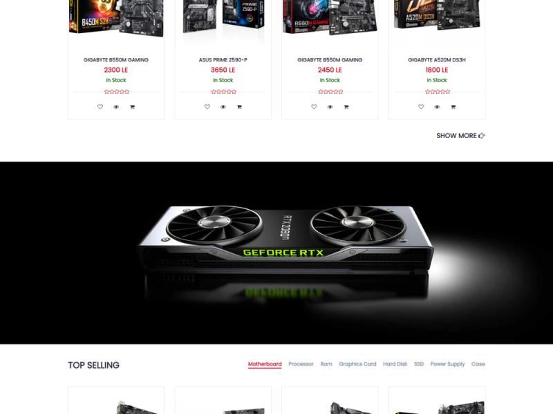

## Hardware Store - Online Marketplace

Welcome to Hardware Store, an online marketplace designed to provide easy access to hardware products for both professionals and DIY enthusiasts. With a user-friendly interface, real-time inventory updates, and seamless transactions, Hardware Store offers a one-stop solution for purchasing hardware materials online.

### Features
## Home Page
  
   <ul>
      <li>Overview about website </li>
      <li>Display all Categories with Products</li>
   </ul
## All Products 
    
   <ul>
      <li>Overview about website </li>
      <li>Display all Categories with Products</li>
   </ul
### Tech Stack
#### Frontend:
HTML, CSS, JavaScript , JQuery , Bootstrap 
#### Backend:
ASP.NET Core MVC
SQL server 
#### Payment Integration:
Stripe
#### Others Concepts 
Git
Clone the Repository
```
git clone https://github.com/your-username/hardware-store.git
cd hardware-store
```
